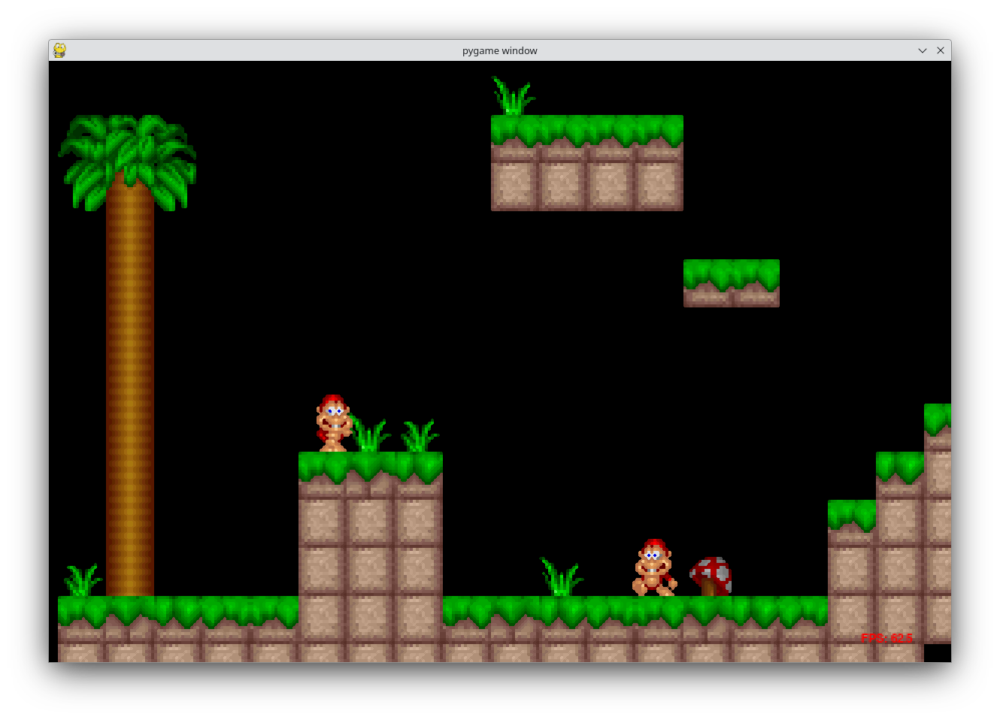

# 2D-Platformer

A simple 2D Platformer built with PyGame.



## Highlights

* No OOP stuff were possible (no inheritance, no polymorphism, no virtual methods and no patterns -ever) but still Python, so you will find [data classes that are the closest thing in PY to a C-like struct](https://stackoverflow.com/questions/35988/c-like-structures-in-python) also some 3rd party PyGame classes.

* Easy to extend and create custom behaviors (see *characters.py*).

* Basic [Tiled](https://www.mapeditor.org/) support (see *tilemap_scripts.py*).

* Also includes:

    * Static collisions against a tile-based map and dynamic collisions between characters (see *game_scripts.py*).
    * Side scrolling for a tile-based map with completely aligned cameras and using offsets (see *game_render.py*).
    * Character sprite-animations updated according to entity state (see *game_render.py*).

## Instructions

* Install Python *3.12.x* from https://www.python.org/

* Run this command to download PyGame:

    ```
    pip install -U pygame --user
    ```

* Open folder with VSCodium (VSCode) and press F5.
